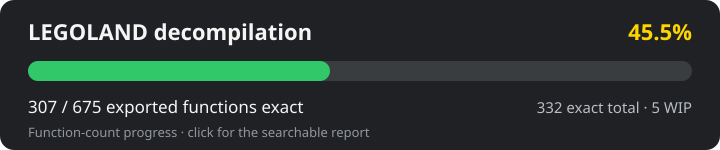

# LEGOLAND decompilation

This is a work-in-progress matching decompilation of **LEGOLAND** (Windows,
2000) by Krisalis Software and LEGO Media. It aims to reproduce the original
Visual C++ 6.0 machine code as closely as possible, recover the game systems in
readable C, and provide the foundation for a portable version that can run
natively and in the browser.

This project is modeled after the
[LEGO Island](https://github.com/isledecomp/isle),
[LEGO Racers](https://github.com/isledecomp/racers), and LEGO Alpha Team
decompilations.

> **Note:** The matching decompilation and browser runtime are still in
> development. The repository does not yet build a complete playable game.

## Status

<a href="docs/LEGOLANDPROGRESS.HTML"></a>

The current source contains **2849 exact full-body function matches**: **665 of
675 exported functions (98.5%)**, plus 2184 recovered internal functions.
Another 79 functions are marked work in progress. The export figure
overstates completion: measured in bytes of game code, **69.5% is matched
exactly (80.9% including partials)** as of the 2026-09-07 checkpoint
(`python3 tools/coverage.py`; see [docs/HANDOFF.md](docs/HANDOFF.md)). The
searchable
[decompilation report](docs/LEGOLANDPROGRESS.HTML)
is generated directly from the committed reccmp annotations.

Alongside the matching C decompilation, the clean-room asset pipeline can
extract the InstallShield archive and decode the game's sprites, maps, object
definitions, speech, and music metadata. The browser-based **LEGOLAND Data Lab**
already renders real park maps and assets; interactive gameplay is the next
larger milestone.

## Verification

Functions are compiled individually with the original-era **Microsoft Visual
C++ 6.0 SP3** compiler and compared instruction-by-instruction with a legally
owned copy of `legoland.exe`. A committed `// FUNCTION:` annotation means the
entire function body passes the extent and normalized-instruction checks; near
matches use `// WIP-FUNCTION:` instead.

```bash
# Compare one reconstructed function.
python3 tools/match.py LEGOLAND/map.c SetMapTile 0x00461780

# Verify every exact-match annotation.
python3 tools/verify.py

# Regenerate or check the public progress report.
python3 tools/progress.py
python3 tools/progress.py --check
```

See [docs/DECOMP.md](docs/DECOMP.md) for the matching workflow and recovered
subsystem notes.

## Getting started

1. Obtain your own copy of LEGOLAND. No copyrighted game assets or binaries are
   included in this repository.
2. Extract the installer archive:

   ```bash
   python3 tools/iscab.py extract /path/to/main.z -o gamedata/main
   ```

3. Install the analysis dependencies and locate the original binary:

   ```bash
   python3 -m pip install reccmp pefile capstone
   reccmp-project detect --search-path original
   ```

The original executable must match this target:

| Binary | SHA-256 |
| --- | --- |
| `legoland.exe` | `c50865b60bfcb26c0a7329a75fb772b10ae234af324f669901906e5abb0e2bd9` |

## Project structure

- `LEGOLAND/` — matching C reconstruction of `legoland.exe`
- `symbols/` — 675 function and 41 data exports, plus analysis symbol data
- `tools/` — extraction, disassembly, matching, audit, and report tools
- `web/` — browser-based LEGOLAND Data Lab
- `docs/` — format research, roadmap, and decompilation notes

## Contributing

Keep functions focused and ordered consistently, use reccmp annotations, and do
not mark a function exact until both normalized matching and the full-body
extent audit pass. Small, subsystem-focused changes are easiest to verify.

## Legal

This repository contains no original game code, binaries, or assets—only
clean-room analysis tools and human-written reconstruction code. You need your
own copy of LEGOLAND to verify or run the project. This project is not affiliated
with or endorsed by the LEGO Group, LEGO Media, or Krisalis Software.
